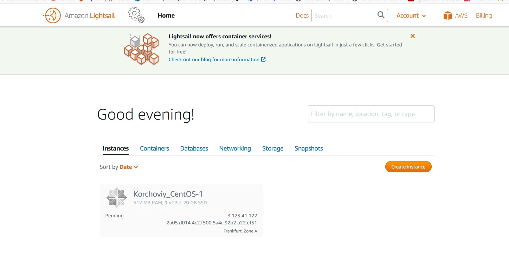
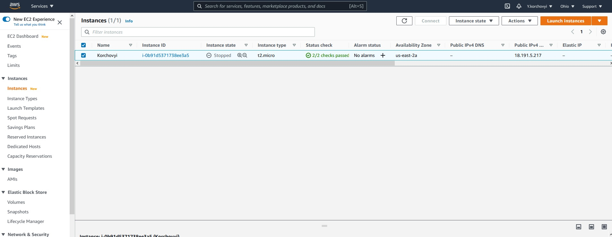
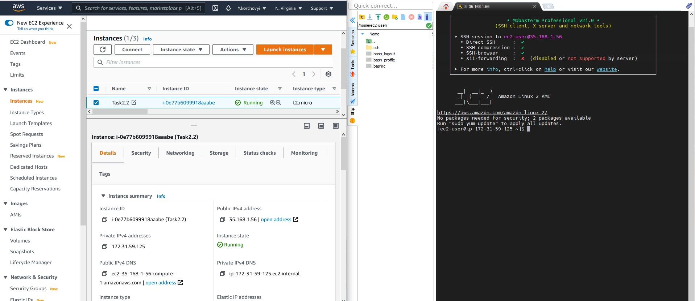
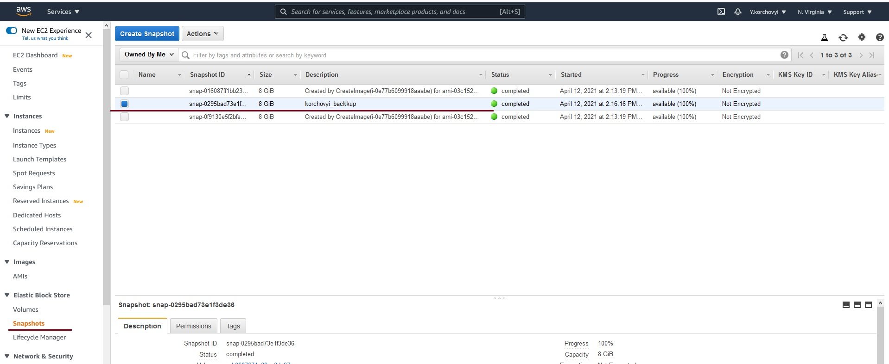
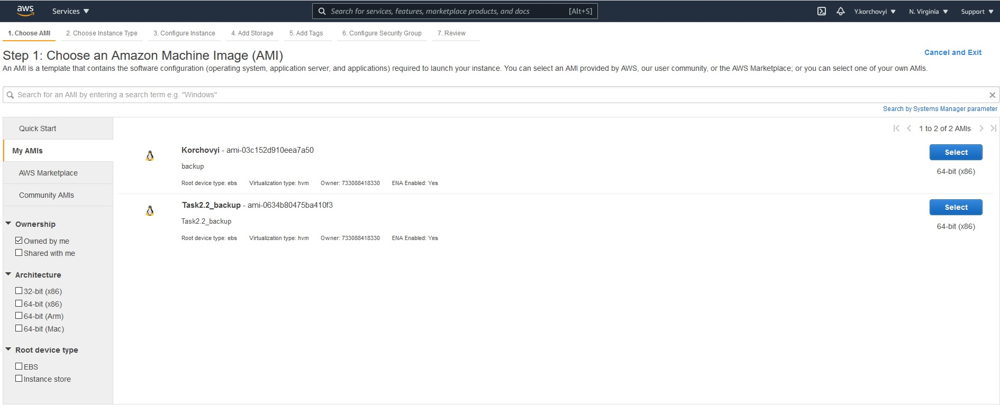
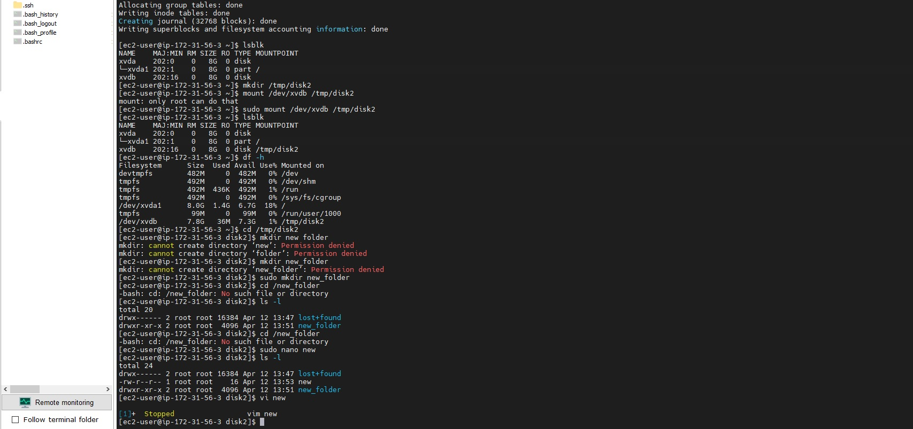
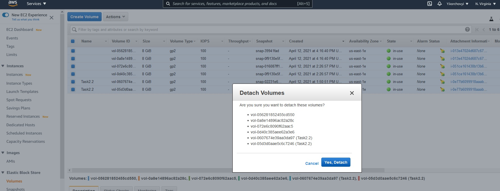
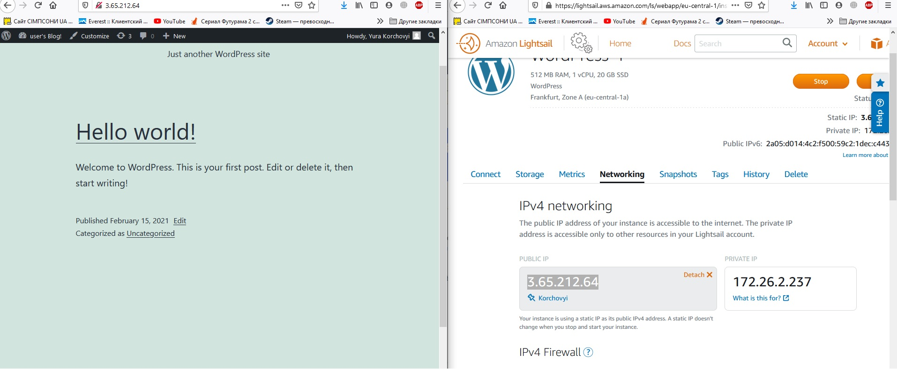

# Task2.1
***

__Створення выртуальноъ машини на базы CentOS за допомогою Amazon Lightsail__

__Створення выртуальноъ машини на базы Amazon_Linux за допомогою EC2__

__пыдключення до даноъ машини за допомогою протоколу SSH__

__Створення бекапу образу віртуальної машини__

__Приклід 2 snapshot__

__Підключення та монтування додаткового диску на сервері Amazon_Linux EC2 через протокол SSH__

__Видалення__

__Створення та конфігурування WordPress за допомогою Amazon Lightsail__
