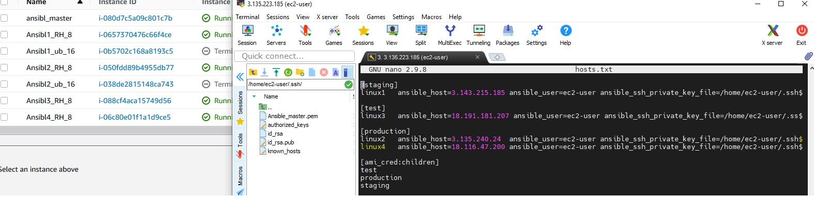

# Task10.1
***

__Виконуємо заповнення hosts фалу, для Ansible_master__

__Перевірка працездатності 1 pleybook__

__За допомогою playbook2.yml проводимо на 4 віртуальних машинах встановлення Web-server__

__За допомогою playbook3a.yml копіюємо html на Web-server та перезапускаємо його__

__За допомогою playbook3c.yml аналогычно 3а перевіряє які системи встановелно та перезавантажує Web-server__

__За допомогою playbook5.yml копіюємо index.html та style.css на Web-server__

