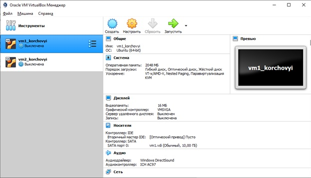
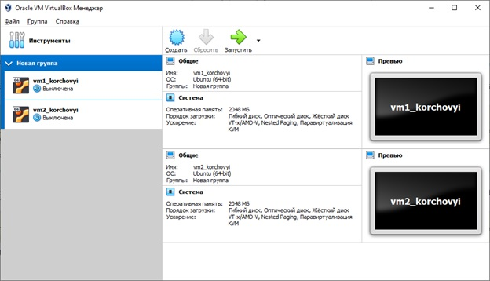
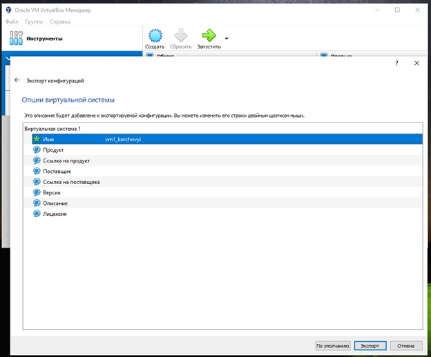
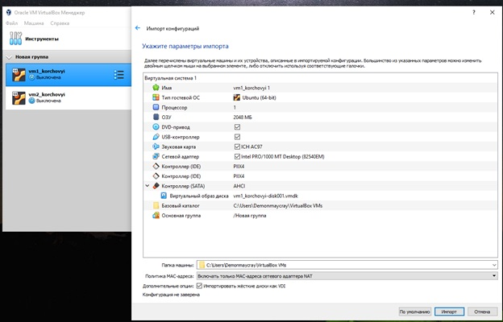
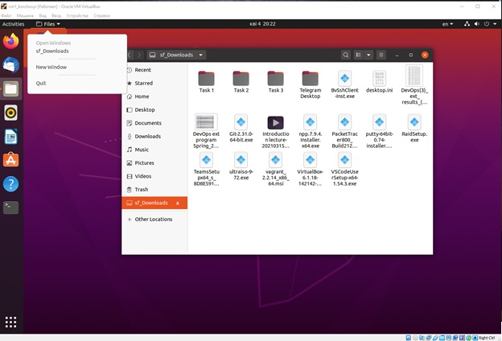
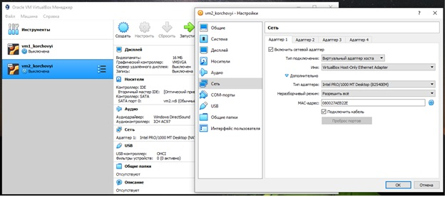
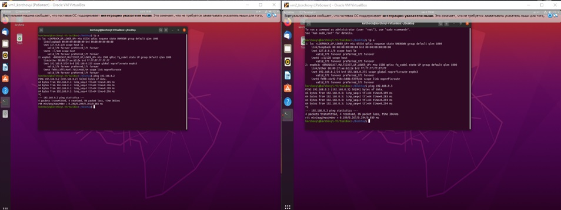
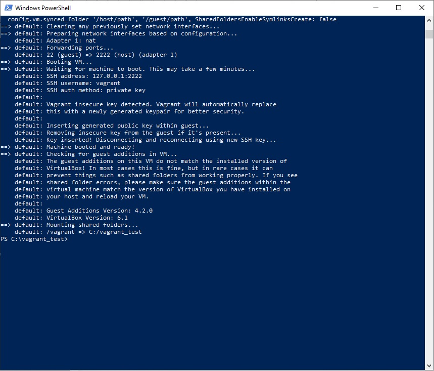
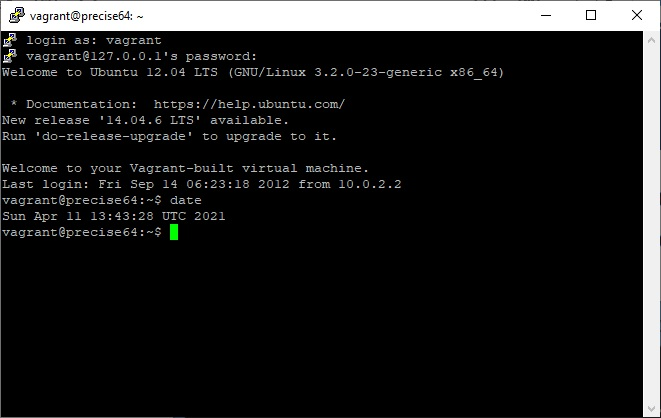
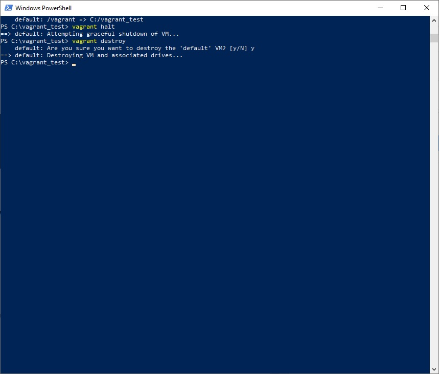

# Task2.1
***
__VBOX part__

__Створення 2 віртуальних машин за допомогою VirtualBox__
 

__Добавлення 2 VM в 1 Групу__
 

__Клонування VM1__
 

__Імпорт параметрів VM1__
 

__Перевірка роботи файлів обміну між ОС на стаціонарному ПК, та відкритя папки на VM1__
 

__Налаштування парамтерів Мережі на 2 VM, для перевірки звязку між ними__
 

__Приклад налаштовано мережі на VM1 та VN2 та за допомогою Ping перевірка працездатності__
 

***
__Vagrant Part__

__Створення тесту за допомогою Vagrant__ 
 

__Створення та запуск VM за допомогою Vagrant__
 

__Перевірка роботи за допомгою PuTTY. Превірка дати та часу на робоччій станції__
 

__Відключення, та видалення даних по VM__
 
