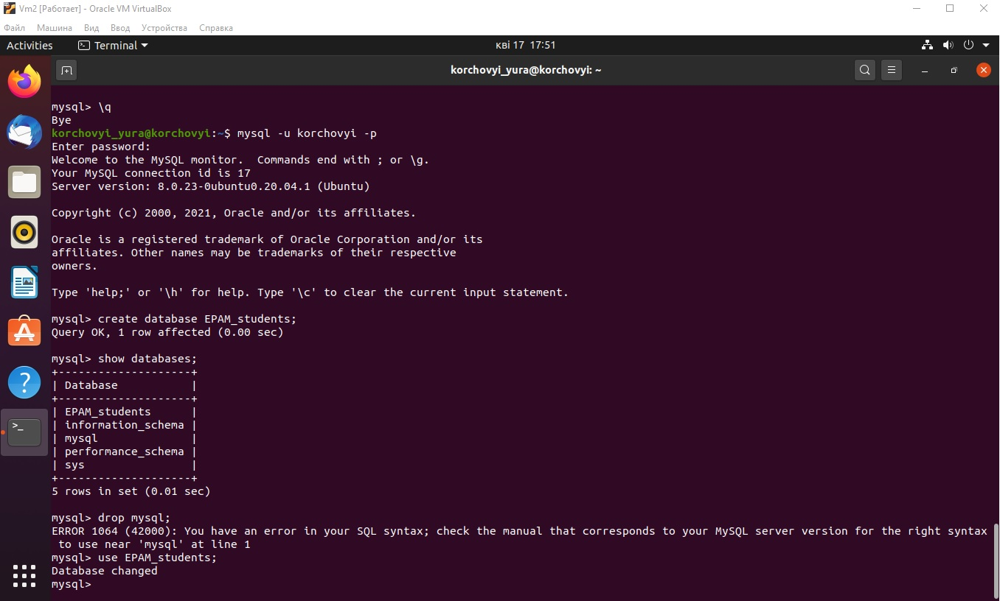
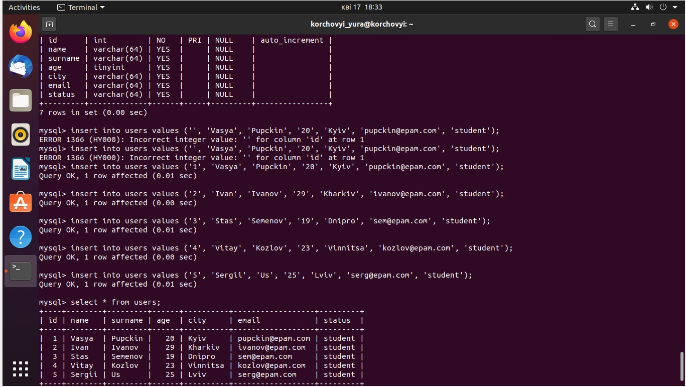
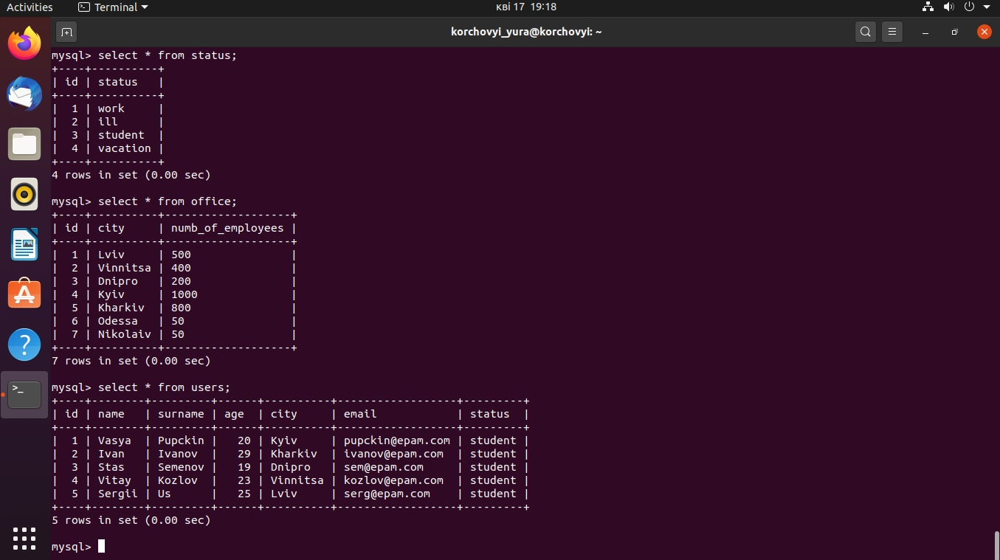
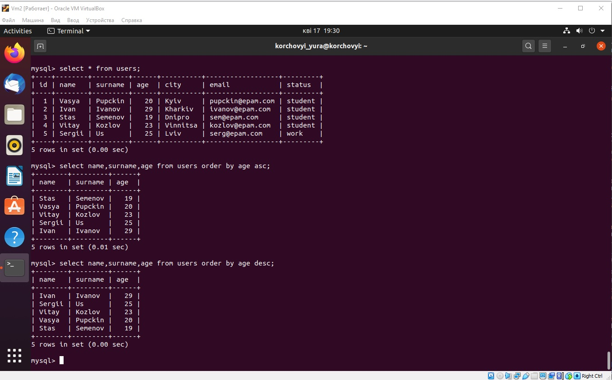
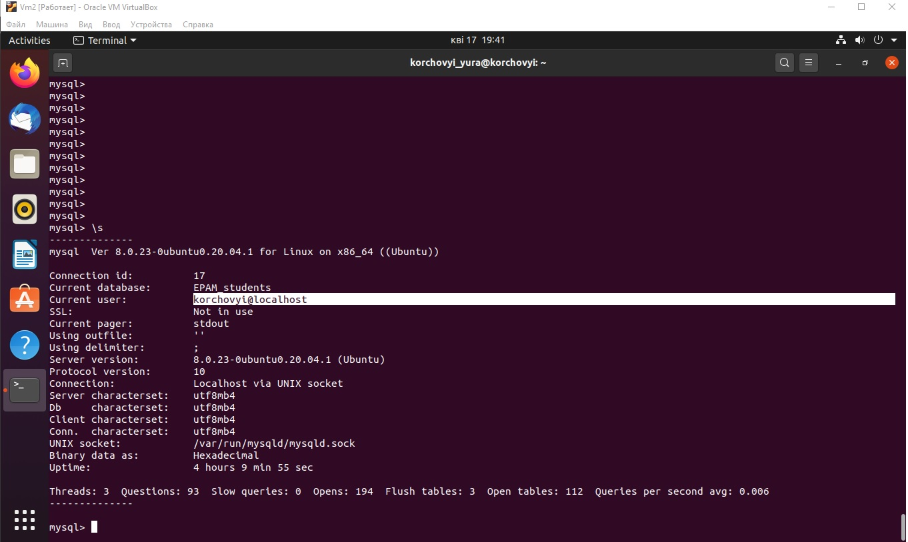
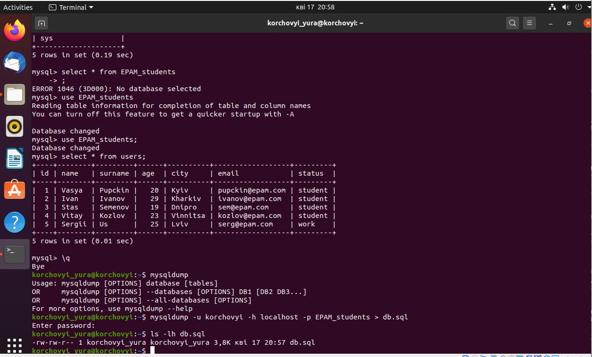

# Task3.1
***
__Для входу в Mysql використовуємо наступну команду mysql -u root -p. В якій -u -це користувач пыд яким виконуэться вхыд до бази. -р пароль для входу. В приклыжі користувач використовується korchovyi.
Створення користувача виконуэться за допомогою команди, як приклад : 
create user 'korchovyi'@'localhost' indetified be 'password';
flush privsleges;__

__Пісдя створення за домомогою команди : Create database name; Необхідно створити таблиці які будуть наповнювати нашу базу, за допомогою команди : create table name; Та наповнюємо її за допомогою команди: insert into tables vlues ('', '',) tables - це назва бази, яка використовується. За допомогою ('',) - добавляються параметри бази в лапках назва параметру.
На скріні вигляд добавлення параметрів, та кінечний вид таблиці. Який дивимось командою : select * from users. Де * вказує на те що вибираємо усі параметри таблиці from users - назва з якої талиці необхідно взяти інформацію, для відображення даних.__

__Готовий вигляд 3 таблиць в нашій базі__

__Приклад використання команд order by для сортування даних таблиці по 1 з параметрів в ній.__

__Дані бази та користувачів які мають доступ до ноє. За допомогою команди select, скорочена форма \s__

__Створення бекапу бази. За допомогою команди mysqldump -u korchovyi -h localhost - p назва бази > файл до якого зберыгаэться база як приклад db.sql 
Для выдновленя бази з бекапу наступна команда mysql -u korchovyi -h localhost -p Base_name < файл з якого розвертаэмо базу.__

