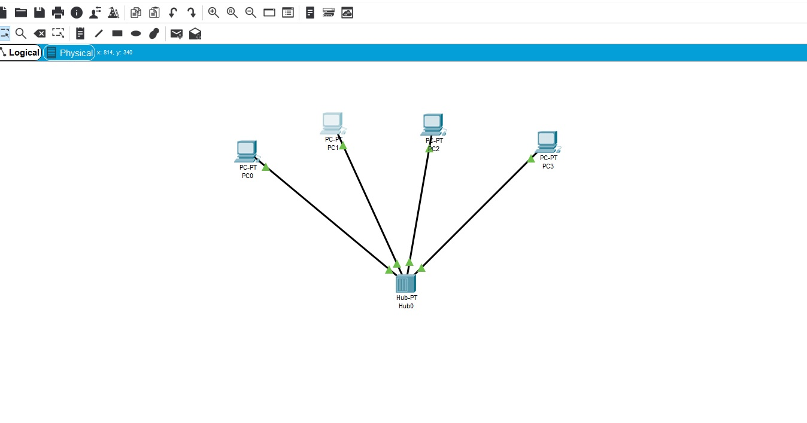
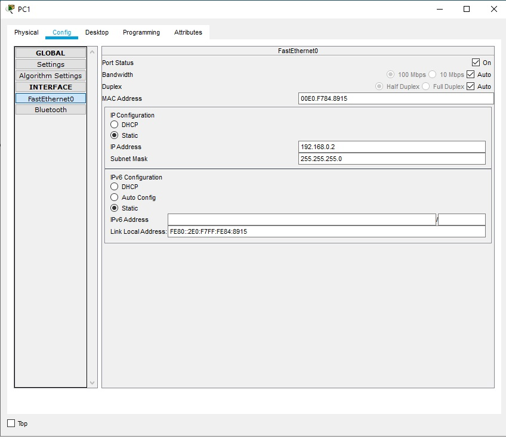
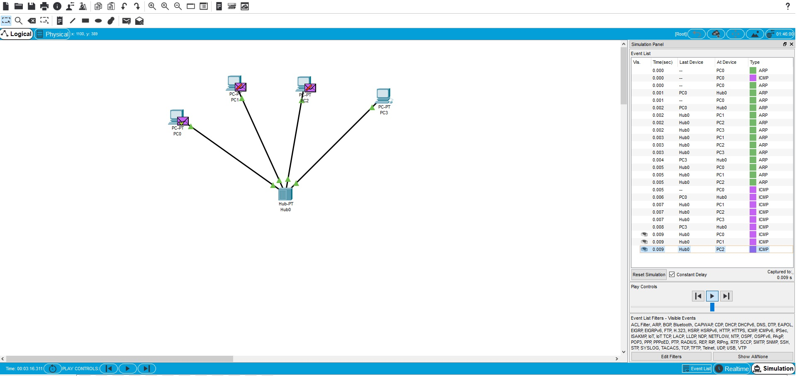
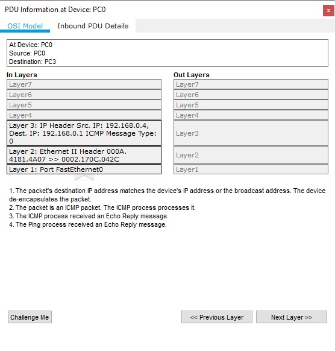
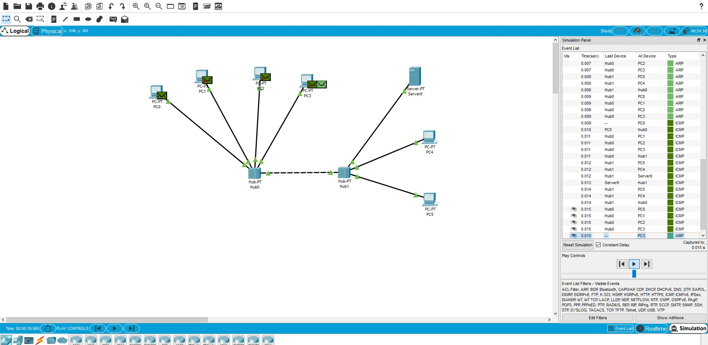
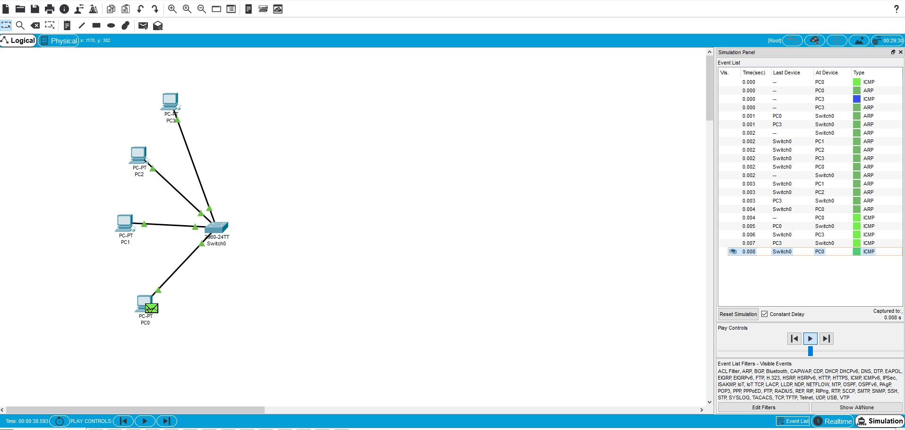
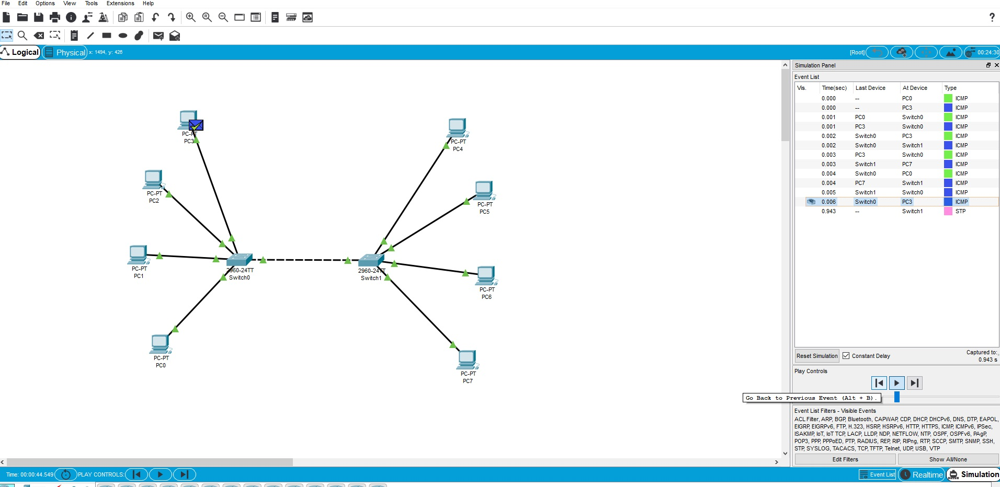
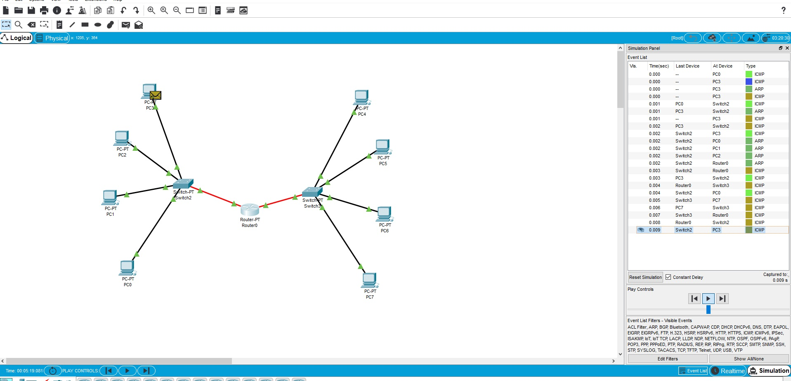
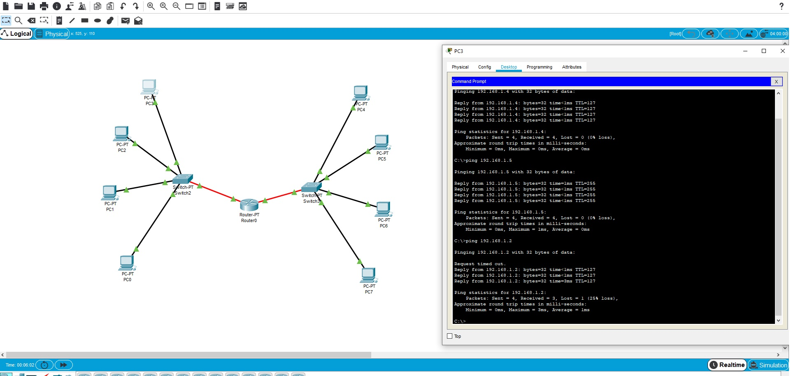

# Task4.1
***
__Створено мережу на 4 ПК на основі HUB__

__Приклад налаштування Ethernet портів на локальних машинах__

__Перевірка маршрутизації на основі HUB. Та приклад доставки пакету з 1 робочої станції на іншу. При мережі на основі HUB, інформація розсилається на всі доступні ПК, які підключені до даного HUB__

__Приклад пакету даних ICMP.__

__Налаштування мережі через 2 HUB. Та приклад роботи мережі.__

__Приклад мережі на основі Swith. Та різниця між роботою з HUB.Різниця заключається в тому, що в Swith є вбудована таблиця MAC-адрес, і він розпізнає з якого адресу на який повинен бути відправлений пакет даних. Та не розсилає пакети на всі ПК які знаходяться у даній мережі, а тільки до кінечного.__

__Аналогічна структура мережі, в якій задіяно 2 Swith. Та приклад передачі даних__

__На даному скріні видно 2 мережі, які зєднані між собою за допомогою Router та налаштовано через Шлюз роботу по між даних мереж. Також передача пакету з 1 мережі на 2.__

__Додатково виконано пінг з ПК 3 (ір -192.168.0.4) на іншу підмережу. При першому ping видно відсутність першого пакету, так як відбувається аналіз мережі на Router.__
