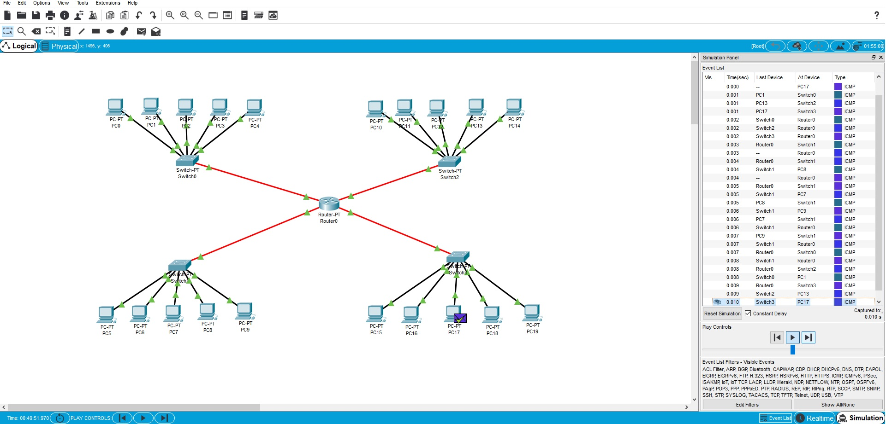
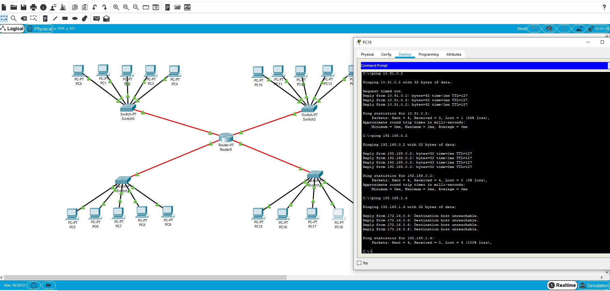
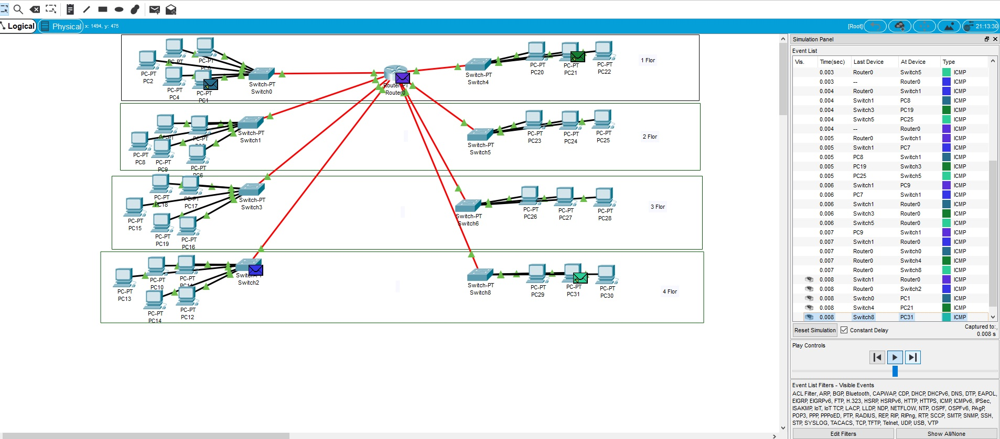
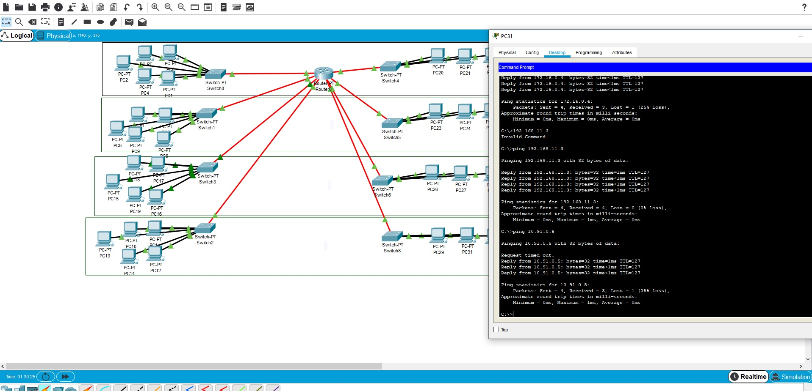
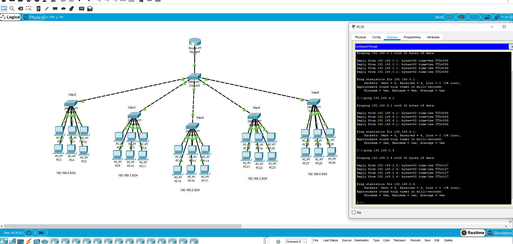
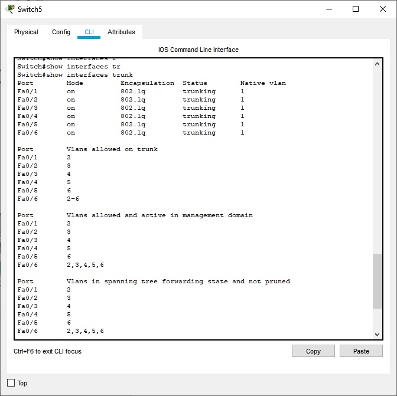

# Task4.2
***
__Створюэмо 2 будинки по 2 поверхи на кожному з яких знаходяться по 5 робочих станіцій. Налаштовано 4 мережі на кожному з поверхів свою. На даному скріні видно готову мережу з перевіркою трафіку пакетом__

__Перевірка всіх підмереж через командний рядок__

__Створення та пере вірка мережі яка складається з 8 підмереж. Перевірка роботи за допомогою пакету__

__Перевірка всіх підмереж через командний рядок__

__Створення мережі яка включає в себе 5 будинків, які заведені в окремі VLAN. Налаштовано на Роутері підмережі для кожного з VLAN. Налаштовано мережу, та перевірку її__

__Приклад конфігурацій центрального Комутатора, та налаштування Trunk портів на ньому__
