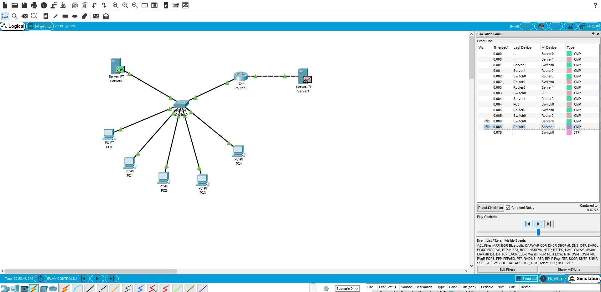
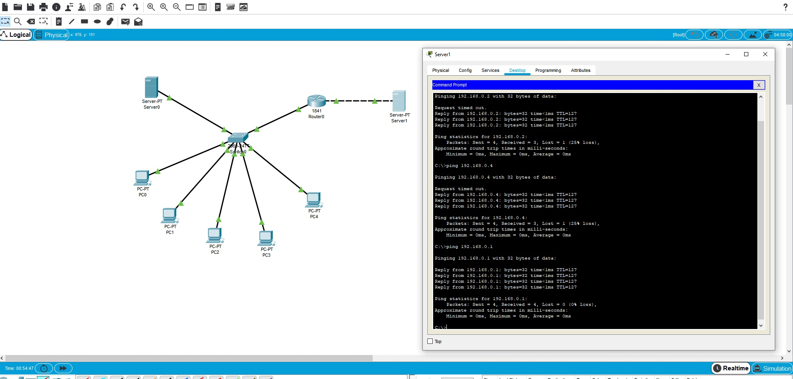
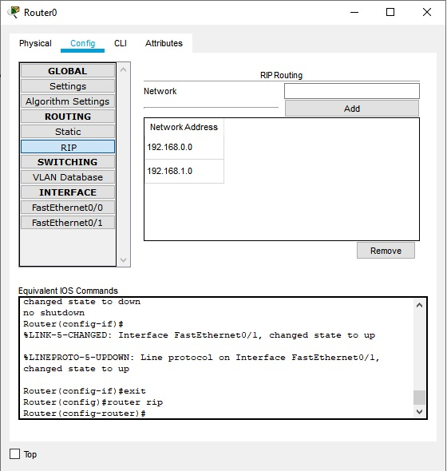

# Task4.3
***
__Створення мережі з 2 підмереж 192.168.0.0 та 192.168.1.0 та налаштування RIP протокола для роботи між ними. На скріні відправлено 2 паукта з успішним результатом__

__Перевірка роботи мережі через Ping__

__Налаштування RIP протокола на роутері__
