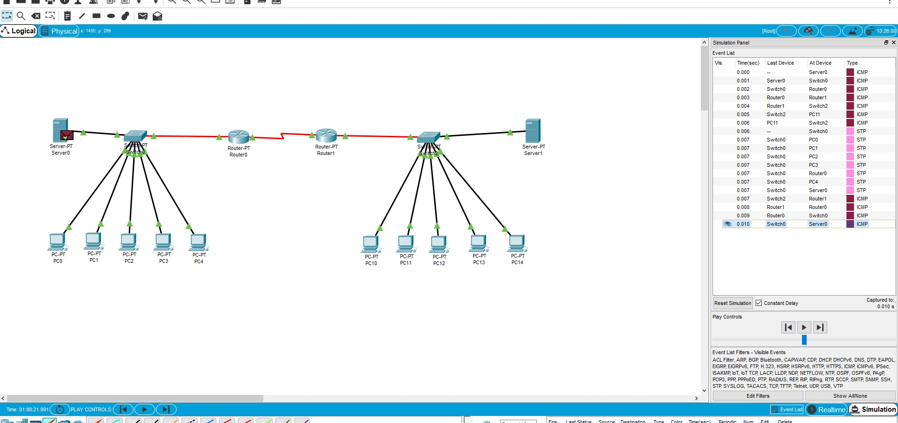
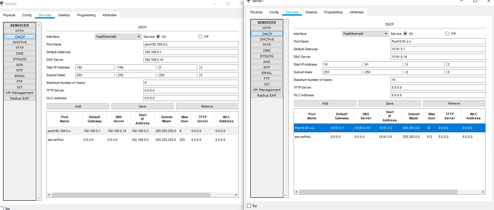
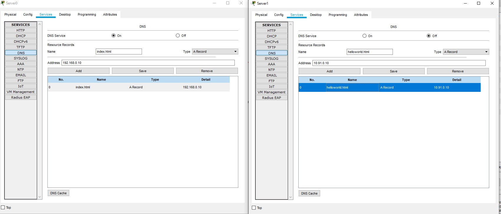
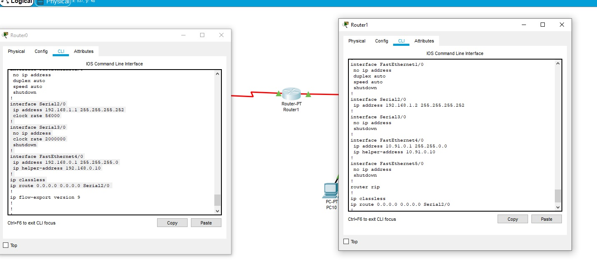
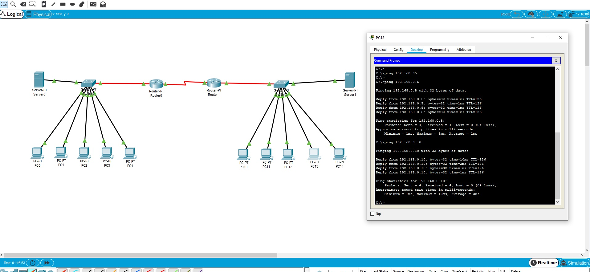
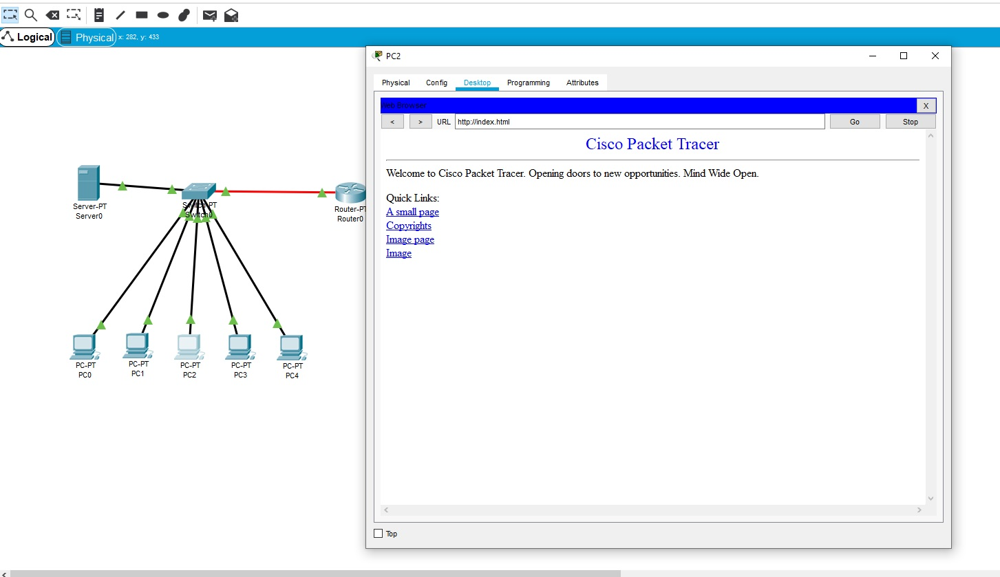

# Task4.4
***
__Створення мережі з 2 підмереж 192.168.0.0 та 10.91.0.0 Дані мережі зєднані між собою за дапомогою Serial зєднання через 2 роутера. На скріні показана робота між даними 2 мережами__

__Налаштування DHCP сервирів які підключені до кожної з мереж. Також на серверах піднято DNS__

__Налаштування DNS на серверах__

__Конфігорування портів на маршрутизаторі__

__Перевірка мережі за допомогою Ping з 10.91.0.0 рінгкємо Пк мережі 192.168.0.0__

__Перевірка роботи DNS на ПК__
