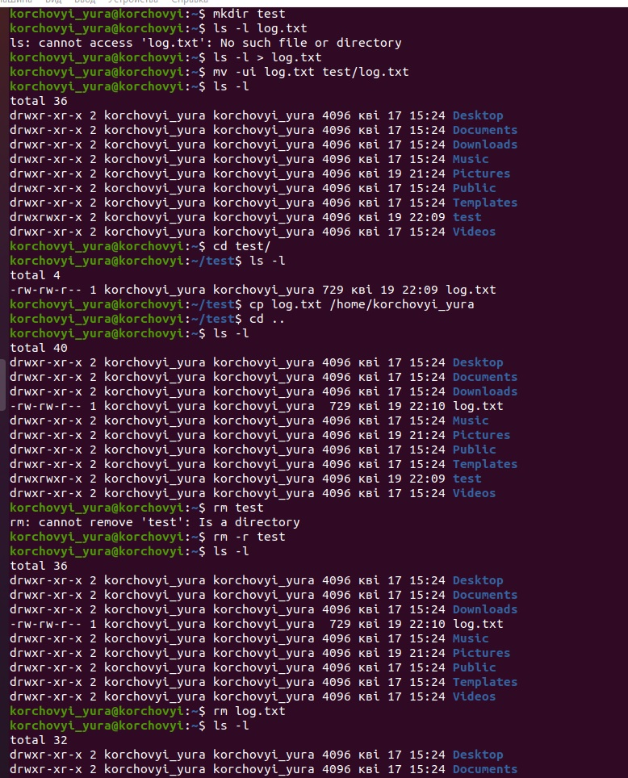

# Task5.1
***

__Для входу під root використовуємо команду sudo su. Для зміни паролю root використовуємо команду passwd. При цьому змінюється інформація у 2 системних файлах /etc/passwd та /ets/shadow__

__Команда man використовується як базовий мануал по заданій команді, як приклад man cat. В свою чергу команда info це текстова документацыя по команді, з гіперпосиланнями на джерела інформації, та інші ресурси. Команда Help - це перелік базових інструментів по командам, як правило часто використовуваних.__

__Комадна more може відображити весь фай, з промотуванням його від початку до кінця, по аналогії з cat - проте дана команда не може вивести великі файли, так як має обмеженя в параметрах виводу.__
__В свою чергу команда Less представляє собою повноціний редактор, з пошуком по тексту, переходом на будь-яку стрічку__ 
__Команда finger використовується для перевіруи інформацію по користувачах.__

__Команда ls служить для перевірки файлів які знаходяться в даному каталозі__

__Команда tree відображає всі каталоги та підкаталоги даного рівня. За допомогою команд tree -L 1 можна відобразити дані необхідного вам рівню вкладеності.__
__За домомогою команди tree -P '*заданий вами текст*' --prune можна знайти файли які містять даний параметер. Можна шукати як по розширіню файлу так і почастині його назви.__

__Для перевырки типу файлу, можна використовувати команду file. Як у прикладу file -z 1.png.__

__Для переходу на домашній каталог використовуємо команду cd або ж cd~. Для переходу в відносний католог cd ../../etc. Команда cd .. повертає на 1 каталог назад__
***
__Команда ls використовується для виводу каталогів. ls -l - виводить всі каталоги які знаходяться в даній діректорії. ls -a - також виводить всі каталоги + приховані. В даному прикладі використав ls -a -l для зручності виводу в терміналі.__

__Втконання таску 5, 2 частини роботи__

__Втконання таску 6, 2 частини роботи. Створення лінків відбувається через команду ln -s "назва файлу, або каталогу на який створюэться лінк" "назва лінку" - створює софтлінк, який є аналогом на ярлик в OS Windows, даний лінк передає всю інформацію яку несе файл, при зміні корневого файлу змінюється дані відповідно і в софтлінку. Проте при зміні назви корневого фалй, чи переміщення в інший католаг, або ж видалення, софтлінк стає неактивним. ln "назва файлу, або каталогу на який створюэться лінк" "назва лінку" -створює хардлінк, який дублює повністю файл на який створюється.__

__Наглядний вигляд роботи softlnk та hardlnk__

__Утилита locate дає можливість знайти шлях до всіх файлі по заданому параметри__

__До системи підключено диски типу /dev/loop1-9 - це віртуальні диски які створюються при створені віртуальної машини. Також наявний диск  /dev/sda - це фізичний диск який виділяється під VM.__

__За допомогою команди wc можна вивести кількість рядків в файлі за допомогою ключа -l, за допомогою ключа -w відображає кількість слів в файлі, за допомогою ключа -c -кількість букв.__

__В даному прикладі виконано пошук з домашнього каталогу всіх файлів які містять в собі слово host за допомогою команди sudo find /ect/ -iname host*__

__В даному завдані виконано пошук за допомогою find та grep всіх файлів та даних які містять в собі ss в каталозі /etc. Команда find шукає по назві файлу яка містоть в собі даний вираз. В свою чергу grep шукає по тексту який знаходиться в самих файлах__

__Команда перенаправлення та виводу каталогу /etc задопомогою less. Картинку склеїв по причині того що less виводить в власному текстовому редакторі, після виходу з нього інформація не відображається.__

__В Linux, існує два типи пристроїв: блочні пристрої з прямим доступом (такі як диски) і символьні пристрої (послідовні порти)__
***
__Звичайні файли - послідовність байтів (текстові документи, виконавчі програми, бібліотеки та ін.);
Каталоги - іменовані набори посилань на інші файли;
Файли фізичних пристроїв, що розділяються на:
• файли блочних пристроїв,
• файли байт-орієнтованих, або символьних.
Символічні посилання__
***
__Команда для виводу файлів які використовувалися в директорії /etc__
