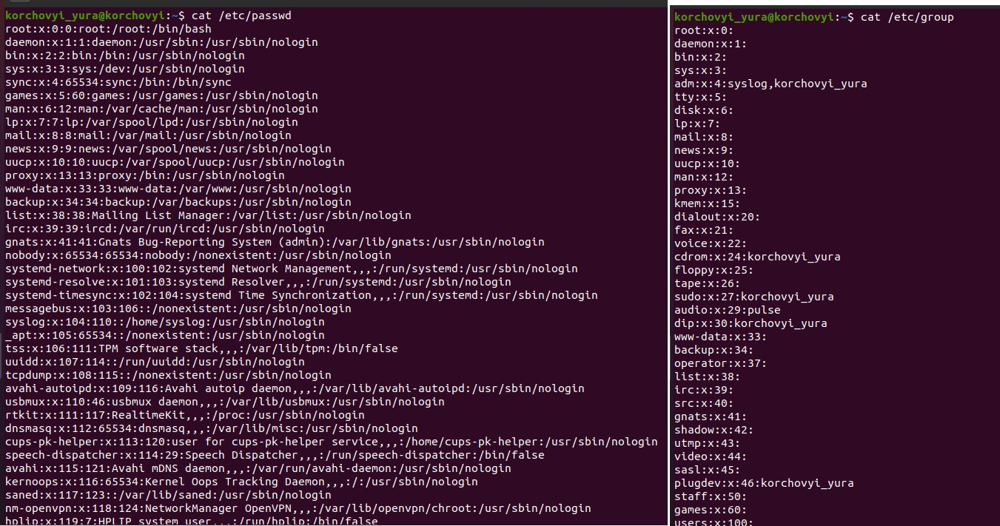
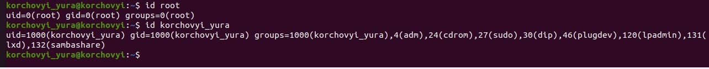
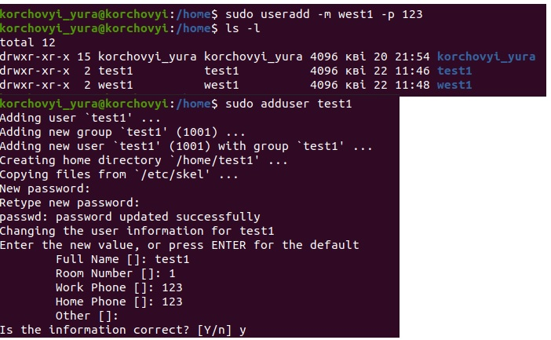
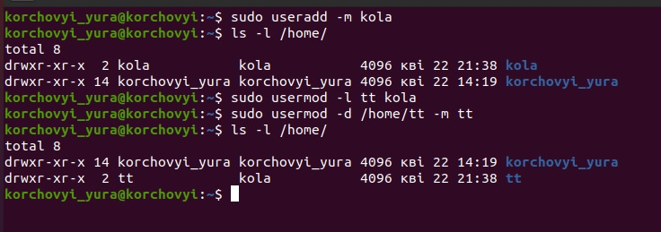
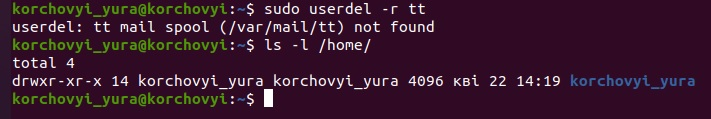
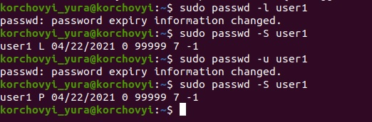
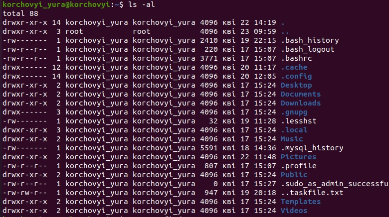
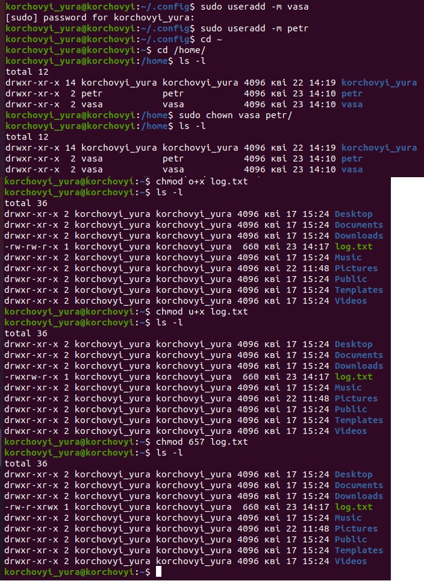
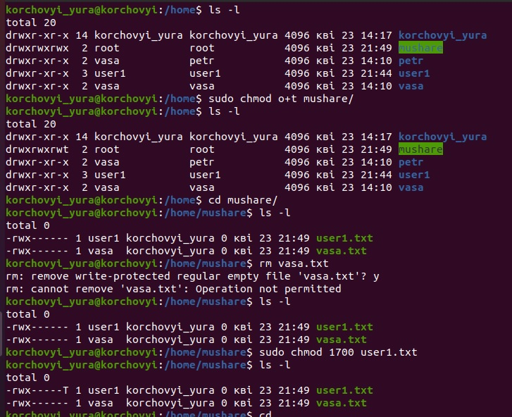

# Task5.2
***

__В файлі passwd ми можемо подивитись інформацію по користувача, до якої групи вони належать, та в якій директорії розміщені. В файлі group видно інформацію по групам користувачі. наприклад root : x : 0 - означає групу суперкористувача, абож адміністратора, остання цифра 0 - це пріоритет виконання команд під даним користувачем. Пріорітет команд по так званих псевдоюзерах йде від 0 до 999. Користувачів та групи які ми створюємо від root починають свою нумирацію з 1000. uid - індитифікатор для користувачів, gid - для груп.__

__Для перевірки до якої групи входить конкретний користувач використовується команда id. В прикладі показано 2 користувача root та korchovyi_yura.__

__Існує декылька способів створення користувача в OS Linux : 1. sudo useradd "назва користувача" - для даного способу використовуються основні ключі -m - створення домашньої директорії в каталозі /home/ -p задати пароль для користувача -с - вказвти коментарі(примітку по користувачу) -b -створення користувача в заданій діректорії. та ін. 2. sudo adduser - це конструктор для створення користувача, всы параметри якого задаються в процесы налаштування.__

__Для зміни параметрів користувача, а саме назви та його катологу(домашньої діректорії) використовується команда usermod. В даному прикладі було створено користувача kola, за допомогою команди sudo usermod -l tt(нова назва) kola(діюча), для зміни домашньї директорії та переіменування її використовується ключ -b__

__Каталог Skel використовується для наповнення діректорій та даних новик користувача. При створені нового користувача всі дані які були збережені в Skel діректорії будуть дублюватися новим користувачам__
***
__Для видалення інформації про користувача необхідно виконати sudo userdel -r (назва користувача) ключ -r необхыдний для видалення всых даних та директорыъ даного користувача.__

__Для блокування користувача використовуэться команда passwd від супер користувача з ключем -l. Для відновлення доступу(розблокування) ключ -u. Для перевірки статусу в якому на даний момент знаходиться користувач -S. Для того щоб стерти пароль користувача використовується ключ -d__

__Для того щоб перевырити структуру каталогу використовуэться ls -l ключ -а показує всі файли та каталоги в тому числі і приховані. 1 блок 10 -8бітних комірок в яких відображається доступ до каталогу. 2 блок -вказує скільки підкаталогів знаходиться. 3 блок Користувач якому налажить каталог. 4блок група. Далі дата створення, та сам каталог.__
__Праа діляться на 3 блоки по 3 символа як приклід rwx r-x -rw. Перший блок відноситься до власника файлу, 2 блок для групи якій належить цей файл, 3 блок для всіх інших. Ключ r(read) означає доступ на чтение файла, w(write) - на запис до файлу, x(execut) - на виконаня файлу.__ 

__Для змыни власника директорії або ж файлу використовується команда chown. В прикладі sodo chown vasa (користувач якому надаються права на файл, директорыю) petr/ - шлях до файлу або директорыъ на яку змінюється доступ.__
__Для зміни прав на файл, каталог використовуэться команда chmod, є декілька варіантів використання (буквине та числове), як приклад chmod 0+x log.txt означає що для other (інші користувачі) добавляється доступ на execut. Є 3 групи коритувачів user(u), group(g), other(о). При необхыдносты обрати всы 3 групи можна використовувати наступний запис ugo. Та параметри до яких надається доступ + r(read) +w (write) +x(execut). В числовому кожному з 3 біт (rwx - відповідає 1біт - 8-ової системи) записується числом 7- якщо потрібно доступ на всі 3 rwx параметра. вираховуэться наступним чином r = 4, w = 2 , x = 1.__
__unmask - це стандартна маска прав яка описана в залежносты від версії linux в /etc/.bashrc или /etc/.profile. стандарна маска 0022 яка інтерпритує права 755 по замовчуваню при створені директорії 644 при створені файлу__

__sticky bits зазвичай використовують на директоріях загального користуваня, в які зберігають дані різні користувачі. В прикладі є загальна папка mushare з правами доступу 777. Для того щоб добавити sticky bits необхідно прописати sudo chmod o+t mushart/ (каталог на який привязуємо sticky bits), аналогом даного запису буде o+t це 1777, для відключеня o-t або ж 0777. Даний біт додається для того щоб інший користувач не міг видалити ваш файл, лише ті файли які створено від нього.__

