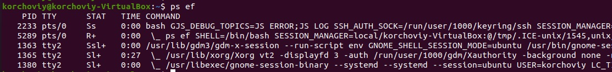
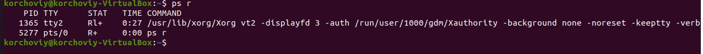

# Task5.
***

__Процеси Linux можуть знаходитись в 5 станах :__  
__1. Running/Runnable (запущений) - процес який викорестовує CPU в даний момент.
2. Sleeping (соний) - процес який очікує на доступність ресурсу. Даний процес ділиться на 2 стани:
2.1 Interruptible Sleep (переривчастий сон) - прокидається при необхідності щоб обробити процес.
2.2 Uninterruptible Sleep (безперервний сон) - не прокидається.
3. Stopped (припинений) - процес який запяється при поступлені запиту зупинки на нього.
4. Zombie (зомбі-процес) - процес який залишається при закриті батьківського процесу.__

__Приклад виводу дерева процесів за допомогою команди pstree__ 

__proc -це файлова система в якій відоюражаються усі процеси які запущені на даний момент__

__Для того щоб вивести інформацію про ваш CPU використовується команда lscpu. Також дану інформацію можна перевірити в директорії /proc/cpuinfo__

__Для того щоб вивести процес по id або ж по назві, використовується коман ps aux - вивід всіх процесів | - перенапрвлення на іншу командк grep 2233 - в даному прикладі вибрати по коду процесу__

__Різниця між процесами ядра, та користувача полягає в тому, що процеси ядра, працюють лише в адресному просторі ядра(не мають власного адресного простору) і можуть бути запущені до запуску ядра. Тоді як процеси користувача мають адресний простір, та запускаються лише після старту ядра__

__За допомогою команди ps ef можна вивести список процесів та їх статус.__

__Для того щоб вивести процеси конкретного користувача викорристовуэться команда ps -U (ім’я користувача)__

__Для перевірки процесів які запущені на даний момен використовуємо ps -r__

__За допомогою команди top можна вивести список процесів в реальному часі. Статус процесів відображається в колонці S більшість з яких знаходсяться в статусі Interruptible Sleep та Sleeping. Також можна перевірити пріоритет процесу в полі NI пріоритети від -20 до 19. Загрузку CPU та ОЗУ, користувача під яким запущено процес, назву процесу, та uid__

__Для того щоб вивести в утиліті top процеси під конкректним користувачем необхідно натиснути u, після чого ввести назву коористувача.__

__Інтерактивні команди які використовуються в утіліті top : h - допомога(справка), f - сортування по заданому полю, u пошук по користувачу під яким запущено процеси, < та > -для зміни сортування по іншій колонці, k - для видалення процесу.__

__За допомогою < та > можна змінювати сортування по різним стовбцям в утиліті top. Встановлено сортування по ОЗУ__

__Пріоритет виконання процесу в linux позначається як nice та може бути в 40 пріорітетах від -20 до 19 включаючи 0. 0 пріорітет це стандартний пріорітет при запуску процесу від користувача, -20 являється найвищим пріорітетом восновному це процеси ядра. Команди для роботи з пріоритетом nice- запуск процесу з заданим пріорітетом renice - змінап пріорітету процесу. В самій утіліті top змінити пріорітет є можливість, якщо він запущений від sudo по ключу r після чого вказати pid процесу, та задати необхідний пріорітет__

__При використаны команди kill в утіліті top викорустовються типи сигналів 15 - для перевірки та завершення вказаного процесу, 9 - для жорсткого завершення. Команда kill використовуэться для видалення процесу, пысля команди можна вказати pid або ж назву процесу. killall використовується для завершення всіх процесів по конкректному параметру, наприклад коли є декілька процесів з однаковою назвою__

__Команда sleep демострує створення процесу на заданий проміжок часу. Jobs необхілдний для перевірки запущених фонових процесів, та відображає їх статус, запущений чи призупинений процес. fg(foreground) з номером процесу - дозволяє перейти в процес який запущений на даний момент, для перевірки виконання, при виході через CTRL+Z процес перейде в статус призупинений. Для того щоб продовжити його виконання використовується команда bg(beground) (з номером завдання). nohup - це утіліта яка захища процеси від зависання, також ігнорує втрату звязку. Якщо запустити nohup sleep, навіть пасля перезавантаження віртуальної машини процес буде продовжений__

__Підключення з локального Пк з ОС Windows 10 до віртуальної мащини на якій розвернуто SSH-Server__

__Для створення SSH ключів по першому прикладу, генерація через cmd за допомогою команди ssh-keygen__

__Cтворення SSH ключів за допомогою PuTTYkeygen, згенерований публычний та приватний ключ необзыдно зберегти у зручне для використання мысце__

__Підключення до сервера за допомогою Putty__

__Підключення до сервера за допомогою MobaXterm__

__Перевырка трафыку за допомогою tcpdump__

