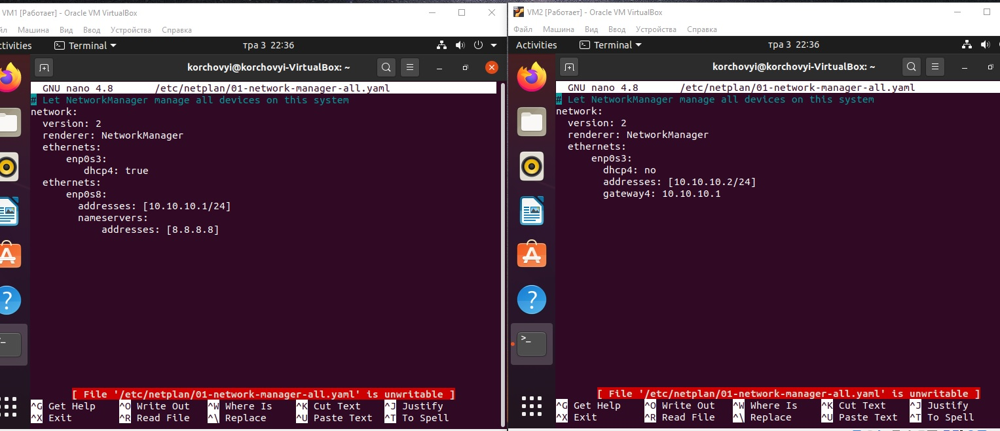
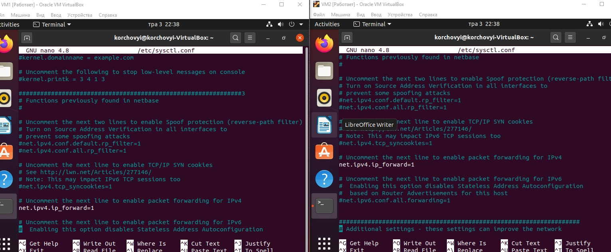
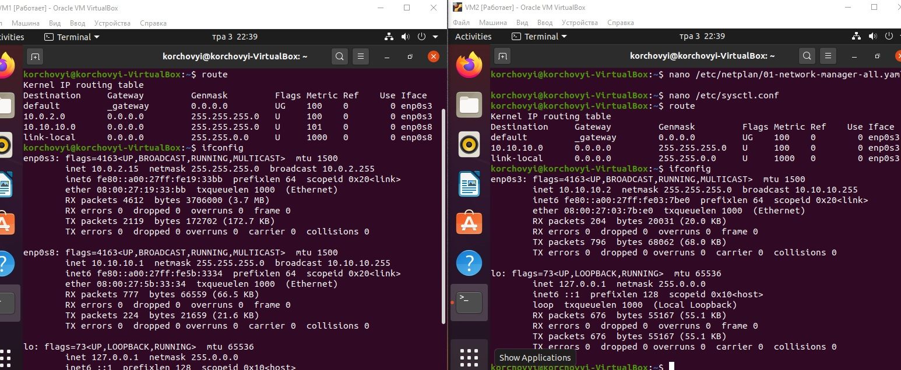
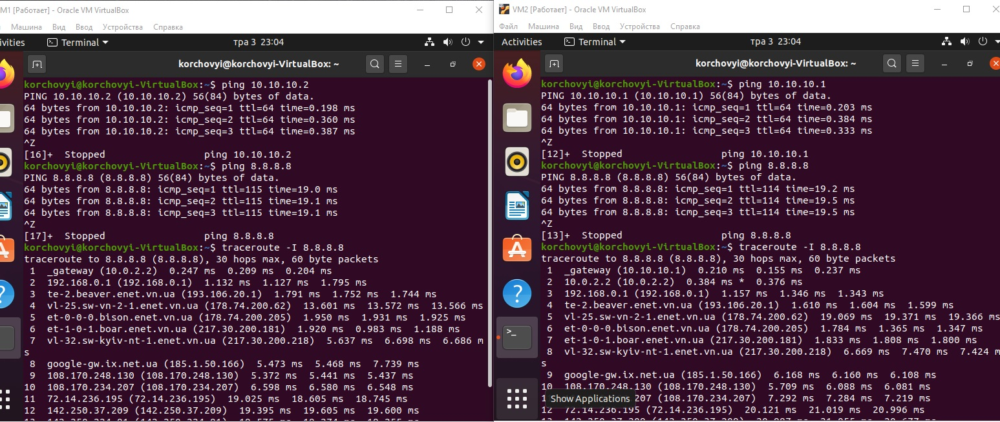
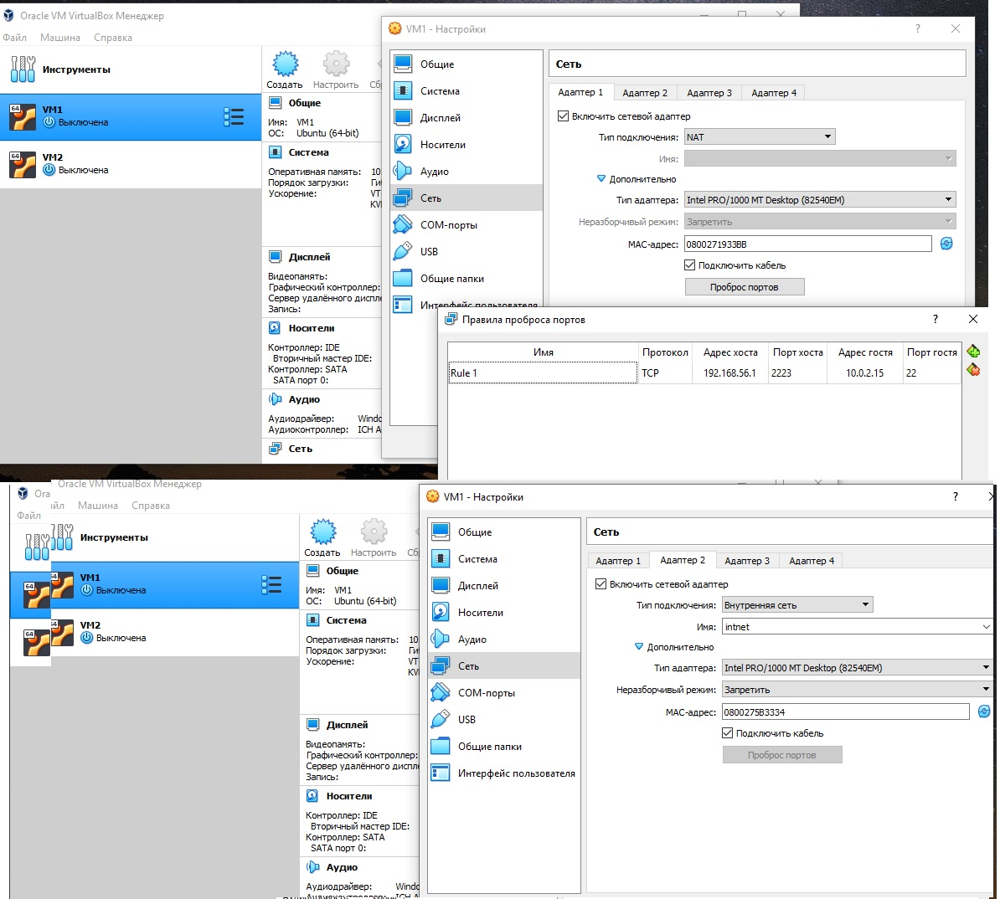
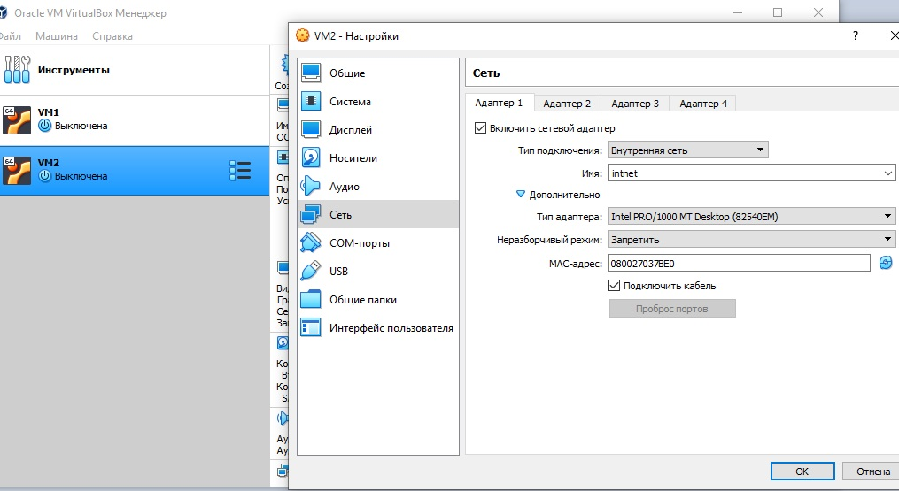

# Task6.1
***

__Налаштування інтерфейсів на Віртуальних машинах. На VM1 налаштовуємо 1 інтерфейс NAT та внутрішньої мережі, через який буде проходити трафік з VM2. На VM2 тільки інтерфейс для зєднання з VM1. Налаштуванння відбуваються у файлі /etc/netplan/файл конфігорування інткрфейсу, на різних системах назва може відрізнятись.__

__В системновму файлі /etc/sysctl.conf вмикаємо параметер net.ipv4.ip_forward=1__

__Перевірка налаштування маршрутизації на кожному з VM__

__Перевірка мережі між 2 VM за допомогою ping, та traceroute на вихід в глобальну мережу, в даному випадку перевірка шляху до google.com (8.8.8.8)__

__Налаштування інтерфейсів в VirtualBox для VM1__

__Налаштування інтерфейсів в VirtualBox для VM2__

