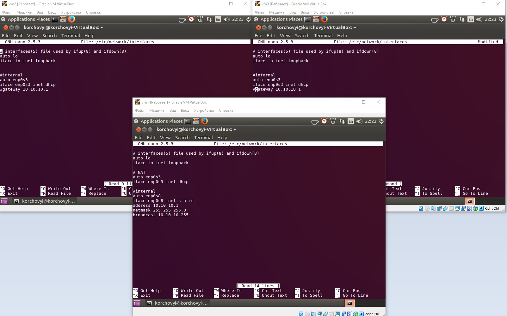
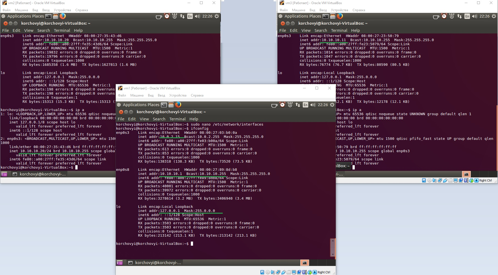
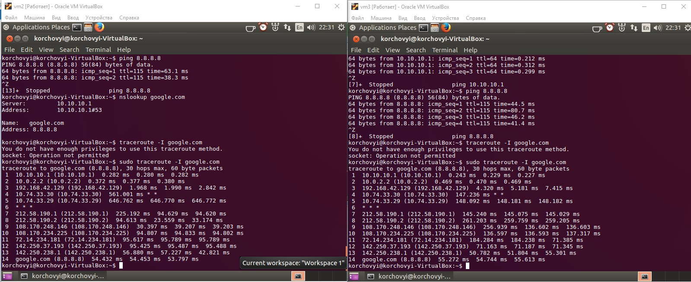
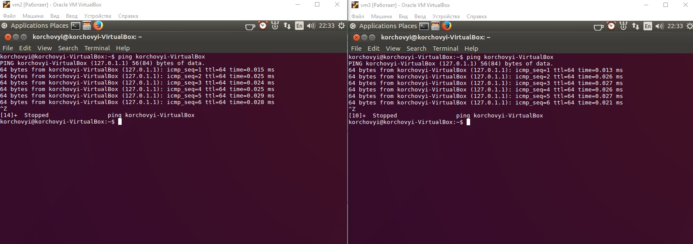
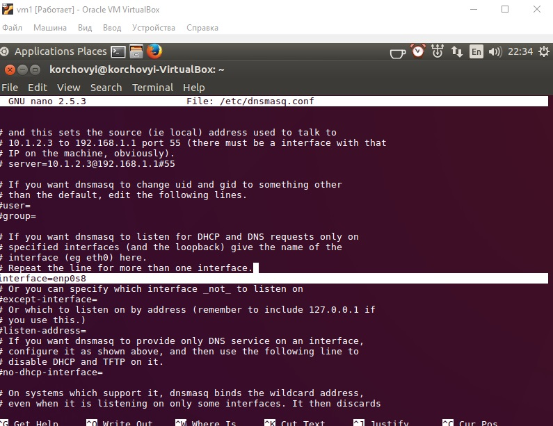
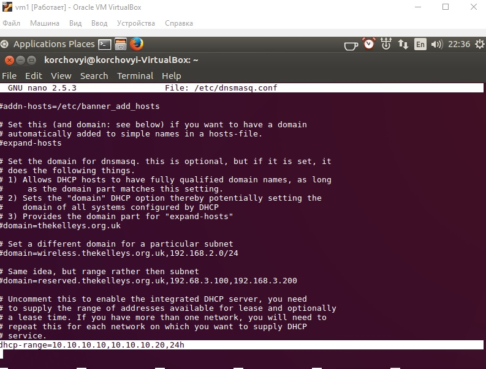
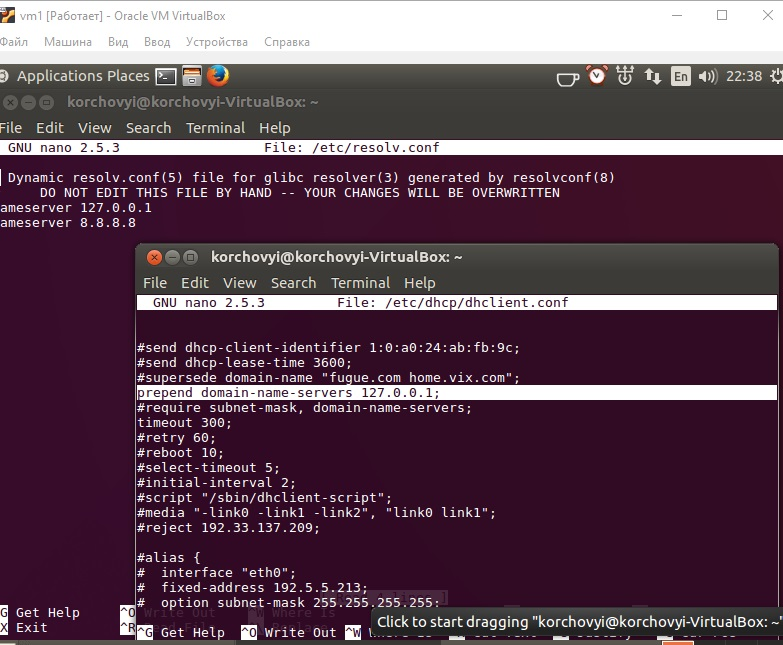
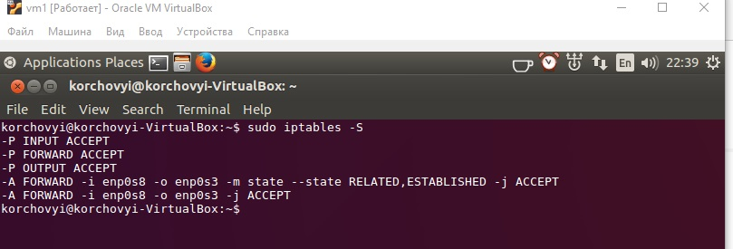
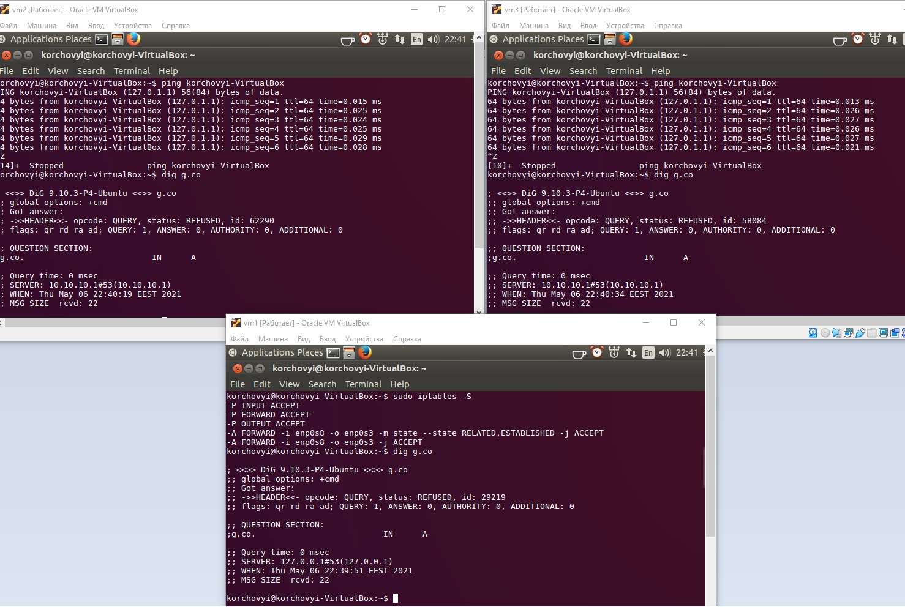

# Task6.2
***

__Налаштування інтерфейсів на всіх VM__

__Приклад налаштування інтерфейсів, та присвоєння ІР для VM2 та VM3 за допомогою DHCP__

__Перевірка VM2 та VM3 на роботу та вихід до зовнішньої мережі. traceroute сайту 8.8.8.8(google.com)__

__Перевірка пінгу по dns-імені на VM2 та VM3__

__Налаштування інтерфейсу enp0s8 на VM1 через який буде виконуватись конект VM2 та VM3__

__Налаштування dhcp протоколу на діапазон адрес 10.10.10.10 по 10.10.10.20__

__Налаштування nameserver на VM1__

__Налаштування маскараду для iptables__

__Перевырка dig g.co на всіх віртуальних машинах__

