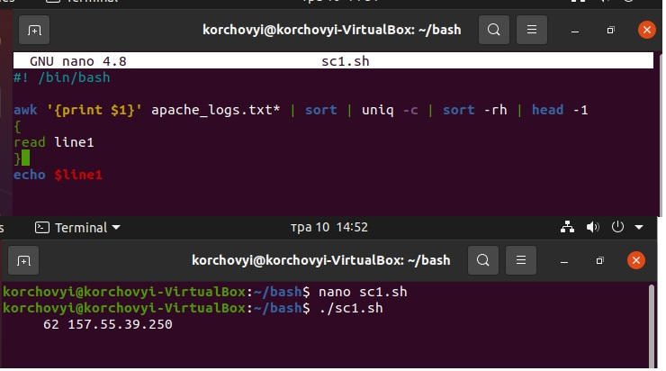
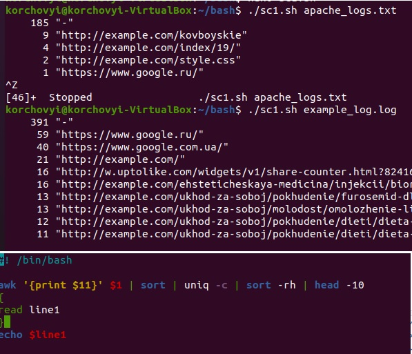
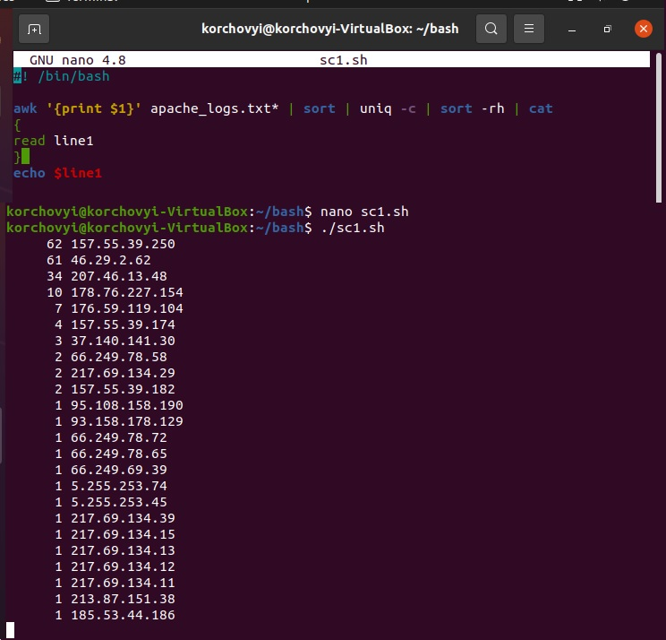
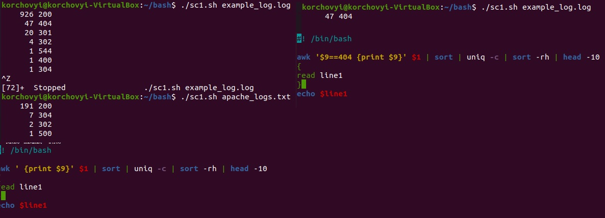
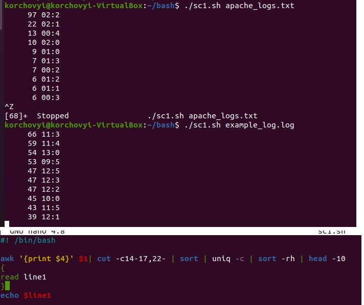
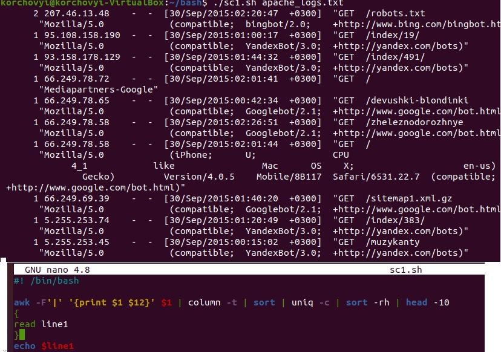

# Task7.1
***

__Скрипт по виводу ІР-адреси, яка виконала найбільше запитів на сервер__

__Скрипт по виводу сайтів на які йде найбільше запитів, з кількістю запитиві на них__

__Скрипт по виводу всіх ІР-адреси та кількість запитів які вони виконували__

__Скрипт по виводу коду стано сторінки. Для втводу інформації загальної вибираємо перевірку по 9 стовбцю. Якщо додатковий фільтр по конкредному коду запита необхідно задати вводимо $9==404 - в даному випадку сортування виконуємо лише по 404.__

__Скрипт по виводу найбільшої кількості запитів за період часу. В даному прикладі виводить кількість запитів кожні 10хв. Якщо необхідно вивод по годимам, змінюємо в параметрі cut на -c14-15,22-__

__Скрипт по виводу ІР з якого поступають запити від Ботів__

