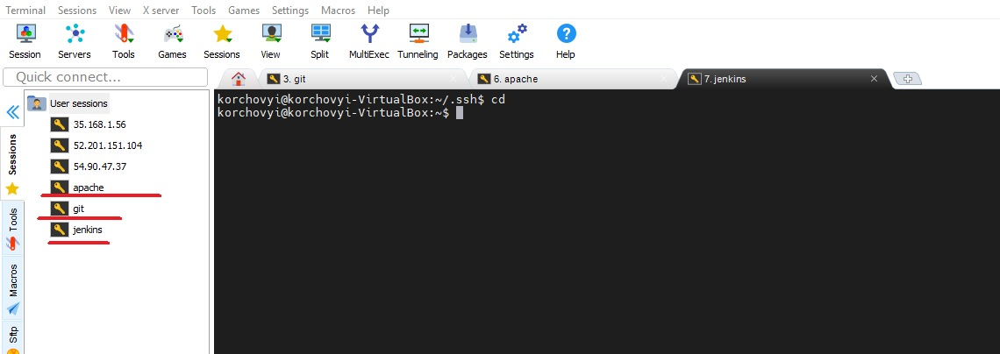
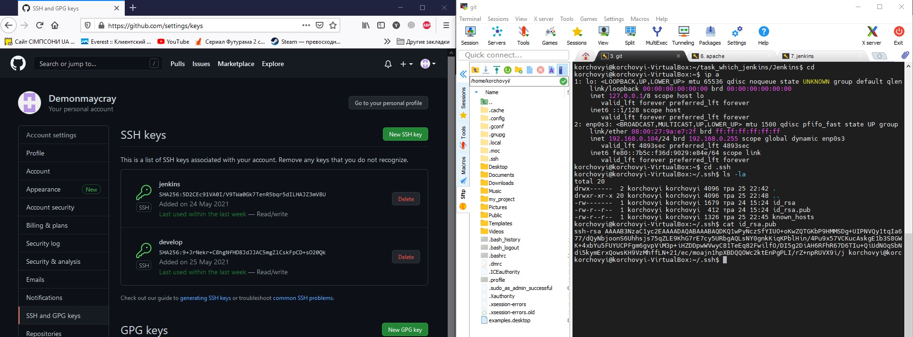
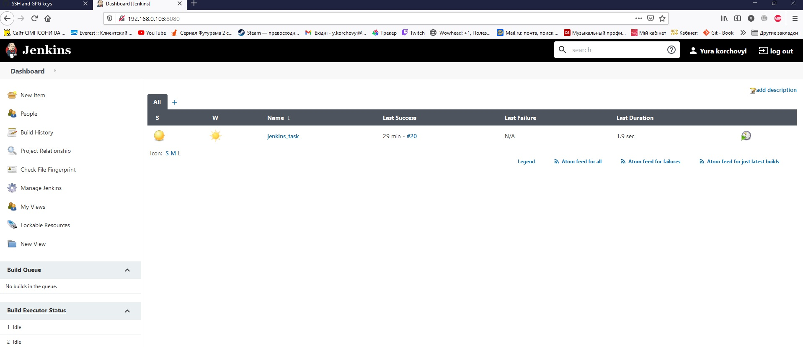
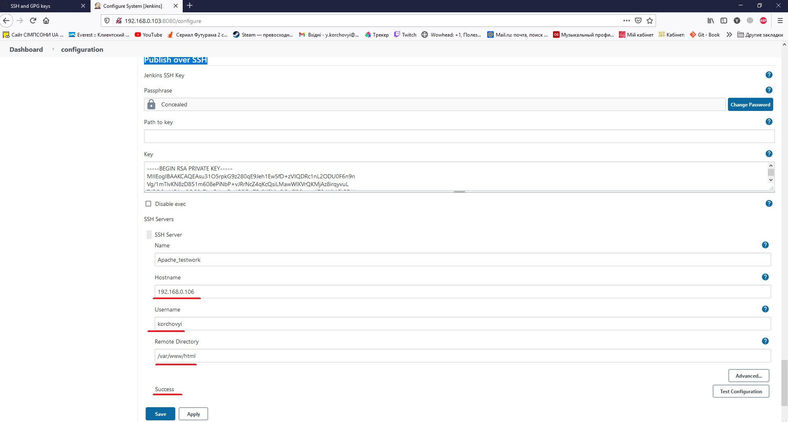
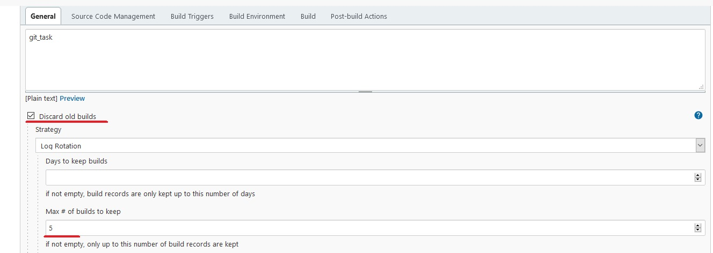
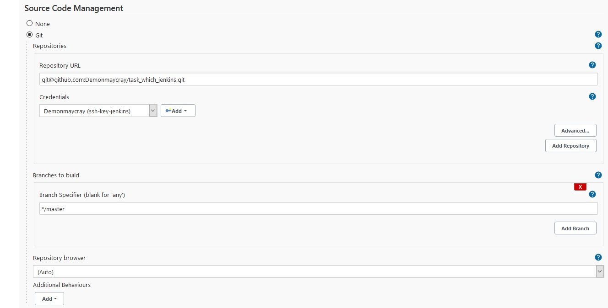
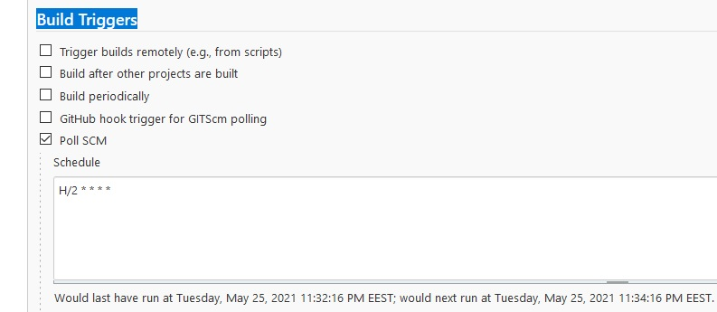
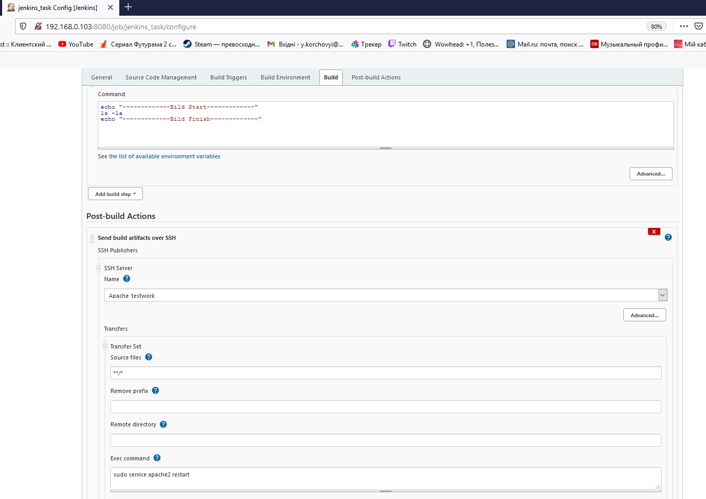
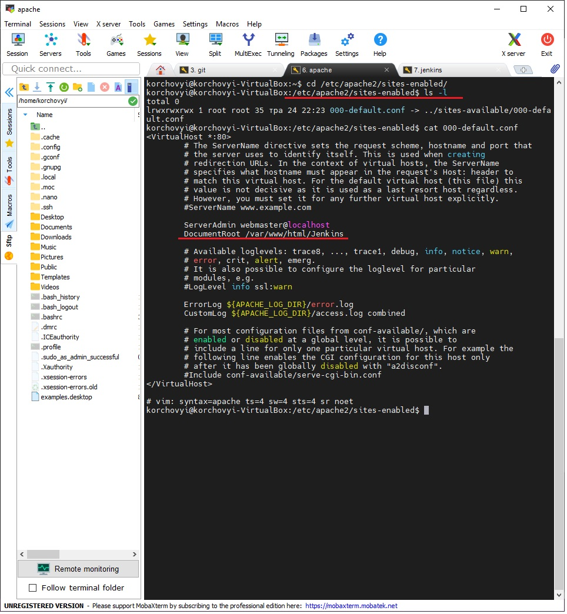
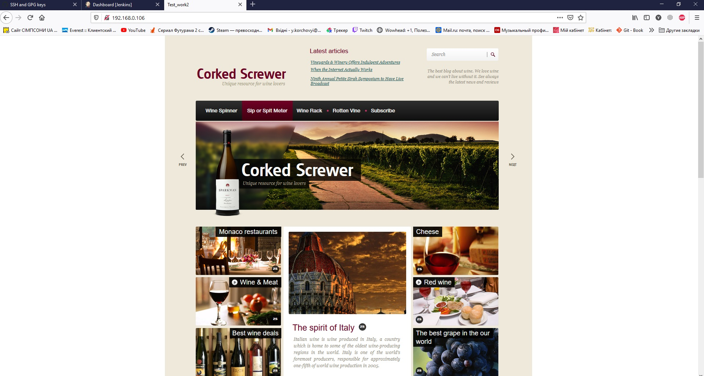

# Task8.1
***

__Для створення проекту на jenkins + web-server, будемо використовувати наступні 3 віртуальні машини. 1. віртуальна машина Git (192.168.0.104) яка буде використовуватись в якості робочої станції для девелопера, для пушу сайту на github. 2. Jenkins(192.168.0.103) для налаштування СI/CD на базі Jenkins. 3. Apache (192.168.0.106) використовуємо як web-server. На всіх маштнах встановлюємо Open SSH__

__Перш за все налаштовуємо shh зєднання нашої github репозиторія та машини для девелопера. копіюємо публічний ключ в налаштування github. Після чого можемо клонувати репозиторій нашого сайту для редагування на віртуальній машині.__

__На машині з Jenkins. Встановлюємо Jenkins та налаштовуємо. Доступ до меню конфігурації відбувається по ІР-адресі сервера, в даному випадку 192.168.0.103__

__Для подальшого пушу сайту на web-server необхідо встановити та налаштувати плагін в Jenkins за назвою Publish over SSH. Попередньо необхідно згенерувати пару ключів та передати за допомогою команди ssh-copy-id korchovyi@192.168.0.106 публічний ключ на web-server. Після чого виконуємо налаштування плагіну в Jenkins__

__Далі створюємо новий проект, і приступаємо до налаштування: 1.Задаємо назву завдання, та задаємо видалення старих білдів, залишатись повино 5 останіх__

__Після чого налаштовуємо перш за все звязок з нашим git репозиторієм для того щоб jenkins міг зібрати код на власнтй сервер для перевірки і подальшого пушу на web-server. Для підключення створюємо конект по ssh__

__Задаємо автоматичну перевірку та збір даних за допомого Build Triggers. Який буде перевіряти зміну інформації в github репі, та при зявленні нових комітів стягувати актуальну версію__

__Далі виконуємо в Build - Execute shell вивід всіх файлів які були стягнені з github. Та налаштовуємо пуш на web-server. Вибираємо назве сервера, яку ми задавали на скріні 4. Вказуємо розміщення директорії з проектом. Так як у даному сайті велика кількість документів та декілька каталогів вказуємо **/*. В кінці виконання пушу на сервер виконуємо команду sudo service apache2 restart - для перезавантаження web-server, та оновлення інформації на ньому.

__На веб сервері встановлюємо Apache2 та налаштовуємо конфіг, для вибору шляху до проекта__

__Вивыд результата__

